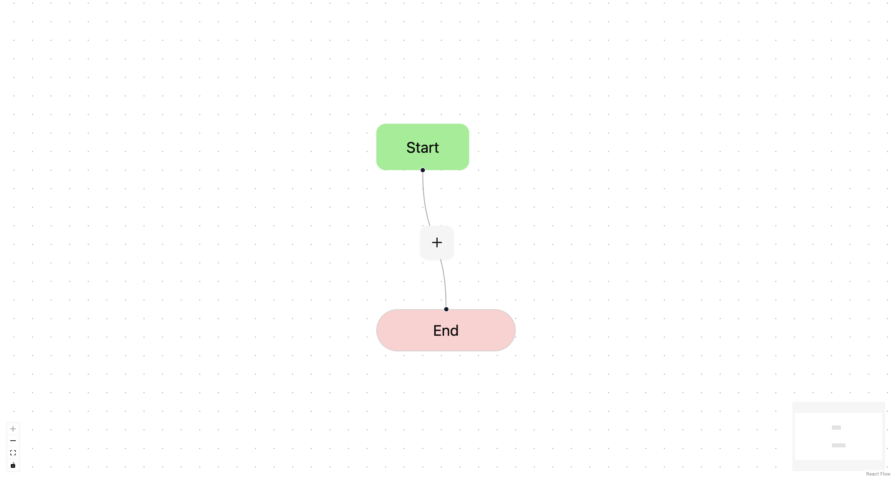

# React Flow Workflow Builder

A modern workflow builder application built using React and React Flow. This application allows users to visually create and edit workflows with different node types including actions and conditional (if/else) branches.



## Features

- **Interactive Workflow Canvas**: Drag, drop, and connect nodes to create complex workflows
- **Multiple Node Types**:
  - Start and End nodes to mark workflow boundaries
  - Action nodes for single tasks
  - If/Else nodes for conditional branching
- **Dynamic Node Management**:
  - Add nodes by clicking on connection edges
  - Edit node properties through intuitive forms
  - Delete nodes with automatic workflow reconnection
- **Auto-layout**: Automatically arranges nodes for optimal visualization
- **Visual Editor**: Real-time preview of your workflow structure

## Installation

1. Clone the repository:

   ```bash
   git clone https://github.com/JithinBathula/exabloom-frontend
   cd exabloom-frontend
   ```

2. Install dependencies:

   ```bash
   npm install
   ```

3. Start the development server:

   ```bash
   npm run dev
   ```

4. Open your browser and navigate to `http://localhost:5173` (or the port shown in your terminal)

## Usage

### Basic Workflow Creation

1. The canvas starts with a Start node connected to an End node
2. Click the + button on any connection to add a new node
3. Choose between Action Node or If/Else Node
4. Configure the node properties in the form that appears
5. Continue building your workflow by adding more nodes

### Editing Nodes

- Click on any Action or If/Else node to edit its properties
- For If/Else nodes, you can:
  - Change the condition label
  - Add new branches
  - Edit branch labels
- Click Save to apply your changes

### Deleting Nodes

- Select a node and click the Delete button in the edit form
- The workflow will automatically reconnect to maintain integrity

## Project Structure

```
src/
  ├── components/            # Reusable UI components
  │   ├── ui/                # Basic UI elements
  │   └── workflow/          # Workflow-specific components
  ├── hooks/                 # Custom React hooks
  ├── features/              # Feature-based organization
  │   ├── workflow/          # Workflow editor related code
  │   │   ├── nodes/         # Node components and logic
  │   │   └── edges/         # Edge components and logic
  │   └── forms/             # Node editing forms
  ├── lib/                   # Utility functions
  ├── types/                 # TypeScript type definitions
  └── constants/             # App constants and configuration
```

## Key Components

### Nodes

- **StartNode**: Entry point of the workflow
- **EndNode**: Terminal point of the workflow
- **ActionNode**: Standard task or action in the workflow
- **IfElseNode**: Conditional branching point
- **BranchNode**: Represents a specific condition branch
- **ElseNode**: Default path when no conditions are met

### Hooks

- **useWorkflow**: Core hook that manages workflow state and operations
- **useLayoutEngine**: Handles automatic layout of workflow nodes

### Forms

- **NodeForm**: Dynamic form for editing different node types

## Customization

### Adding New Node Types

1. Create a new component in `src/features/workflow/nodes/`
2. Add the node type to the `nodeTypes` object in `src/constants/nodeTypes.ts`
3. Create appropriate type definitions in `src/types/workflow.types.ts`
4. Add handling logic in the `useWorkflow` hook

### Styling

- Node styles can be modified in the respective node component files
- For global styling changes, update the CSS in the component style objects

## Troubleshooting

### Nodes not connecting properly

- Ensure that each node has the correct Handle components (source/target)
- Check browser console for any errors

## Acknowledgments

- Built with [React Flow](https://reactflow.dev/)
- Uses [Dagre](https://github.com/dagrejs/dagre) for automatic layout
